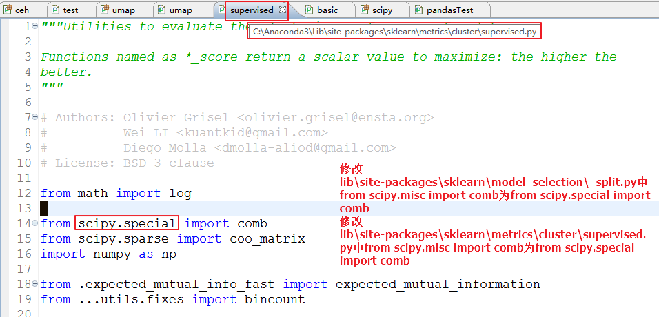

# arithmatic

>word2vec用于推荐.ipynb在装umap-learn后，报了如下的一个错误

```  
File "C:\App\Anaconda3\envs\model\lib\site-packages\sklearn\metrics\cluster\supervised.py", line 21, in <module>
    from scipy.misc import comb
ImportError: cannot import name 'comb'
```  

 修改见图片


